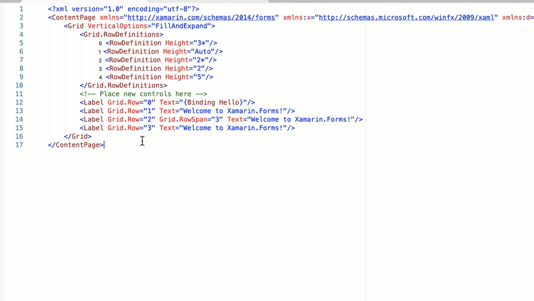

In Xamarin.Forms, the [Grid](https://docs.microsoft.com/en-us/xamarin/xamarin-forms/user-interface/layouts/grid) is a powerful layout container where we can use rows and columns to place controls.

Historically, we would declare our rows and columns using the `Grid.RowDefinitions` or `Grid.ColumnDefinitions` properties. To create a row or column, we would define a new `RowDefinition` or `ColumnDefinition` element and specify its size:

```
<Grid VerticalOptions="FillAndExpand">
      <Grid.ColumnDefinitions>
          <ColumnDefinition Width="*"/>
          <ColumnDefinition Width="2*"/>
          <ColumnDefinition Width="Auto"/>
          <ColumnDefinition Width="300"/>
      </Grid.ColumnDefinitions>
      <Grid.RowDefinitions>
          <RowDefinition Height="1*"/>
          <RowDefinition Height="Auto"/>
          <RowDefinition Height="25"/>
          <RowDefinition Height="14"/>
          <RowDefinition Height="20"/>
      </Grid.RowDefinitions>
</Grid>
```

Introduced in Xamarin.Forms v4.7, developers can declare grid row and columns using a comma-separated list of values. The [**simplified format**](https://docs.microsoft.com/en-us/xamarin/xamarin-forms/user-interface/layouts/grid#simplify-row-and-column-definitions) for declaring and makes declaring .

With this new simplified format, our previous example becomes:

```
<Grid VerticalOptions="FillAndExpand"
        RowDefinitions="1*, Auto, 25, 14, 20"
        ColumnDefinitions="*, 2*, Auto, 300">
</Grid>
```

Using the new format, we removed a significant amount of XAML and made our row and column definitions terser. Adding a new row or column becomes as simple as adding another comma separated value, making makes our code easier to understand and easier to maintain.

Beautiful stuff! 😍

## Migrating To Simplified Rows/Columns

To help you convert your grids to the new format, we introduced the **Convert to attribute format** refactoring into [MFractor Professional](https://www.mfractor.com/buy).

This refactoring converts your existing row and column definitions into the new simplified format:



**As grid row/column shorthand format was introduced in Xamarin.Forms 4.7, the Convert To Attribute Format refactoring will not appear in lower versions of Xamarin.Forms**

To learn more about this refactoring, [please see our documentation](https://docs.mfractor.com/xamarin-forms/grids/shorthand-declaration-refactorings/).
