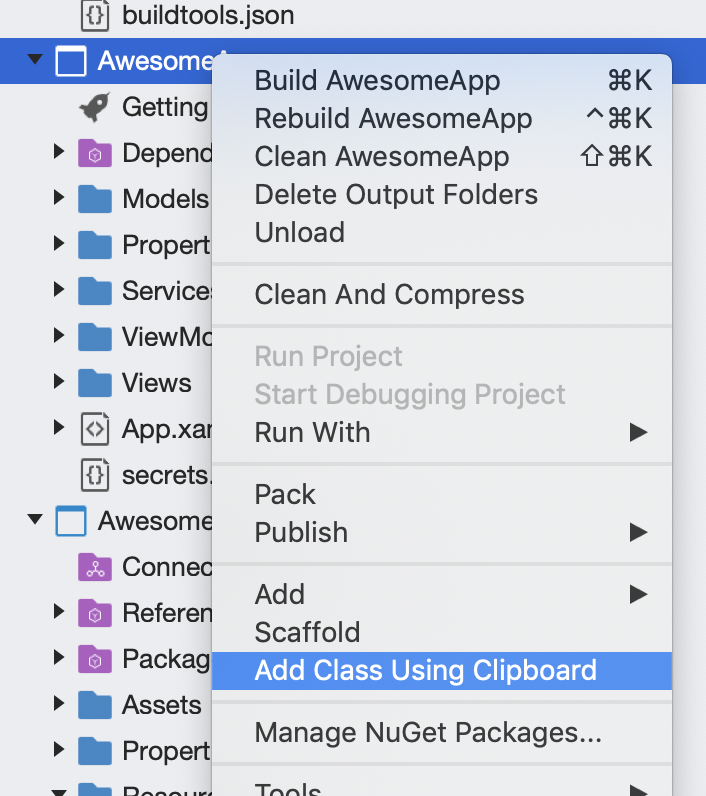

## Introduction

When working as developers, a common workflow is copy/pasting a class from an external source into our codebase.

This class may come from a wide range of sources such as:

 * An answer from StackOverflow.
 * A file or Gist from Github.
 * An online code-generation tool like [QuickType](https://quicktype.io/) or [IconFont2Code](https://andreinitescu.github.io/IconFont2Code/).
 * Another one of our code bases.

Let's be honest, we all do this from time to time 🙈

When we add a class to our codebase using copy/paste, we usually do something like:

  * Copy the code to the clipboard.
  * Open your project and create a new file.
  * Paste the class into the new file.
  * Ensure the file name to match the class name.
  * Cleanup the namespace to match the folder path.

This involves a lot of steps and a lot of manual cleanup work, making it error prone and tedious.

To simplify this, MFractor now includes the `Add Class Using Clipboard` tool, allowing you to create a new project file using the clipboards content.

## Add Class Using Clipboard

When a C# class is in the clipboard, the **Add Class Using Clipboard** will appear in the solution pads right click menu below the **Add** menu.



This launches


The tool will automatically detect the file name based on the clipboards class, correct or create the namespace based on project and folder you are creating it from and then generates a new project file.

This let's us quickly and easily add a class by copy/pasting, avoiding any additional cleanup after we paste the class into a file.

To really examine the benefits of this feature, let's examine two use cases:

 * Adding an class from IconFont2Code.
 * Adding a Github gist.

## Adding An Icon Font Class

As a lover of icon fonts, one of my favourite sites is [IconFont2Code](https://andreinitescu.github.io/IconFont2Code/), a tool that generates a C# class with named string constants for all glyphs in a font asset.

Say we have generated our C# font glyph class using IconFont2Code, the next step is to add the class to our code base.

We first copy the class to the clipboard and then, in Visual Studio, right click on our project and choose **Add Class Using Clipboard**.


When the tool added the `FontAwesomeIcons` class, it automatically did the following:

 * Detected the class name `FontAwesomeIcons` and set this as the project file name.
 * Encapsulated the class in a new namespace using our projects default namespace and folder path.
 * Generated the `Icons` folder path.

## Adding A Github Gist

Over the years I have worked on many different codebases and a common task I perform is profiling code sections when diagnosing performance issues.

To accomplish this, I have a [profiler gist stored on GitHub](https://gist.github.com/matthewrdev/04d12260f78d1404dad63bdb63bfa778) that measures a code section using the `IDisposable` pattern.

```
// Usage
public void MyMethod()
{
  // Outputs "MyFile.cs | MyMethod took 20.45ms"
  using (Profiler.Profiler())
  {
    // Expensive code here
  }
}
```

It's simple and crude but very effective.

When it comes time to profile a codebase, I copy the `Profiler` class to the clipboard and then add it to the codebase I am working on.

This is how I would do it using the **Add Class Using Clipboard** feature.


When the tool added the `FontAwesomeIcons` class, it automatically did the following:

 * Detected the class name `Profiler` and set this as the project file name.
 * Renamed the namespace `MFractor.Utilities` to `HelloMFractor.Utils`, based on our projects default namespace and the provided folder path.
 * Generated the `Utils` folder path.

## Summary

Adding a class by copy and pasting it from a source like Github, StackOverflow or another codebase is a common workflow. To make this easier, you can use **Add Class Using Clipboard** included in MFractor to generate a new class file using the contents of the clipboard.

The **Add Class Using Clipboard** feature is available in [MFractor Professional](https://www.mfractor.com/buy).

😊🤟
Matthew Robbins - Founder of www.mfractor.com
