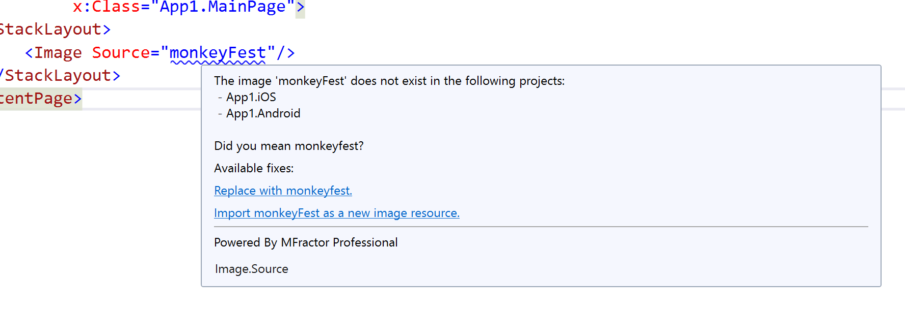
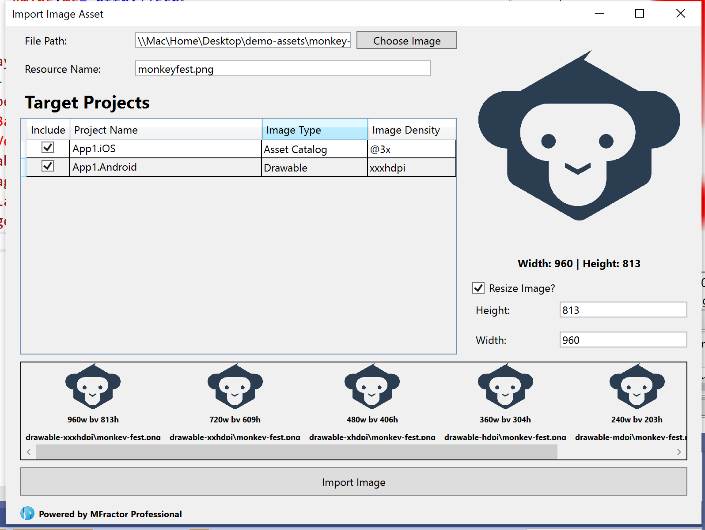
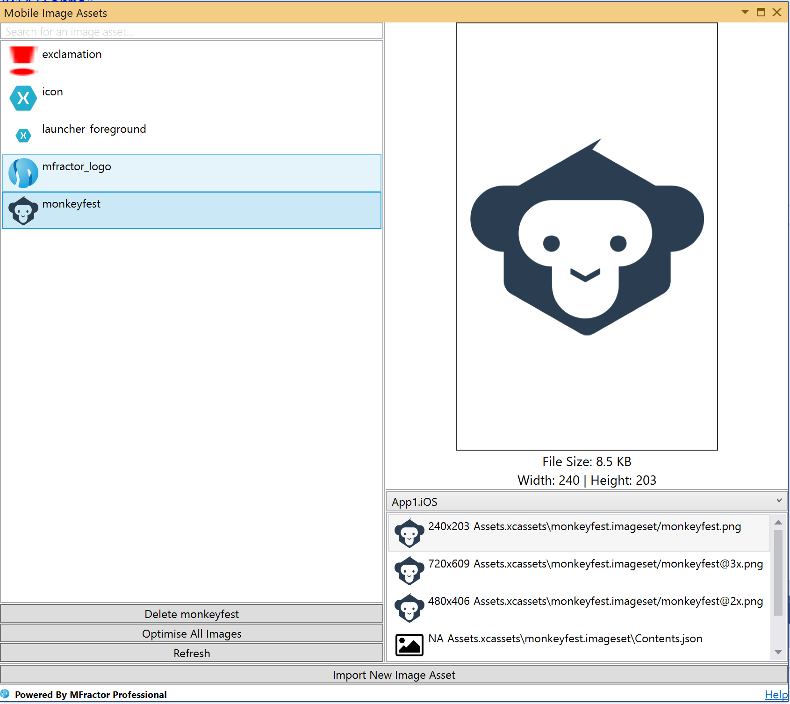
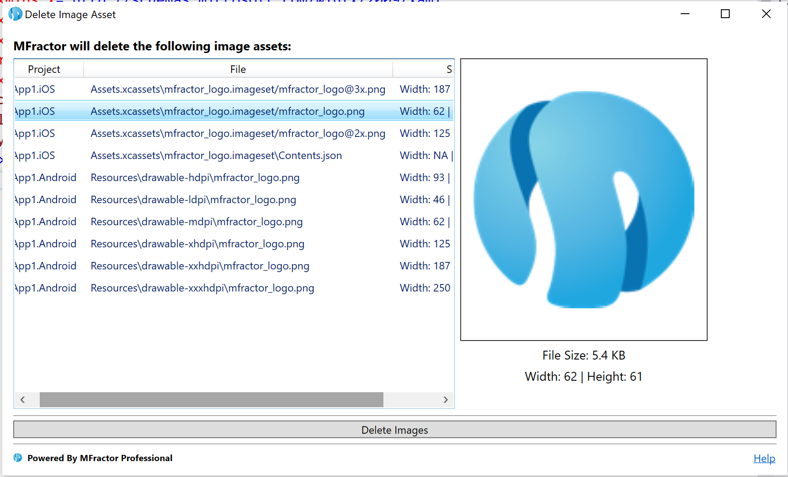

*MFractor for Visual Studio Windows is now available!*

I'm pleased to announce that MFractor is now available for Visual Studio Windows! 🥳

Long anticipated, MFractor is a collection of powerful productivity tools for Xamarin developers. Mac users have long enjoyed our tools and we are excited to now offer Windows developers the same productivity benefits!

## Benefits of MFractor for Visual Studio Windows

MFractor really shines in two major areas of Xamarin development; writing beautiful, bug free XAML and managing the image assets in your Android and iOS projects.

### Craft Beautiful XAML
Amongst Xamarin developers, Xamarin.Forms is a very popular way to create compelling mobile applications with maximum code reuse using C# and XAML.

MFractor enhances this experience in many ways, making it much easier for you to write clean, maintainable and bug-free XAML code.

Our powerful XAML analyser immediately spots 80+ XAML issues while you edit, providing a concise description of the issue and often suggesting one or more fixes you can apply in one click:

Our suite of 90+ XAML refactorings make it dead-easy to refactor, fix and organise your XAML.

For example, noticing a common set of properties in a control type? Use the [Extract Style Refactoring](https://docs.mfractor.com/xamarin-forms/working-with-styles/extracting-styles/) to extract a new style and then our code analysis engine will start finding matches:

MVVM is one of the most common development patterns in Xamarin.Forms and MFractor streamlines your development workflows when using MVVM. Our intelligent view-model resolver can find the ViewModel for a view by [either naming convention](https://docs.mfractor.com/xamarin-forms/binding-context-resolution/automatic-viewmodel-detection/), [explicit binding context wireup](https://docs.mfractor.com/xamarin-forms/binding-context-resolution/binding-context-evaluation/) or [using our DesignTimeBindingContextAttribute](https://docs.mfractor.com/xamarin-forms/binding-context-resolution/design-time-binding-context-attribute/), enabling multiple

Use the View/ViewModel navigation shortcuts to easily move between your XAML views, code behinds and

Our data-binding analysis spots potential binding bugs and allows you to fix them in a single click:

Our ViewModel data-binding IntelliSense conveniently puts all available ViewModel properties at your fingertips:

[Please visit our documentation to see our full range of Xamarin.Forms tools](https://docs.mfractor.com/xamarin-forms/overview/).

### Mobile Image Assets Simplified
Image assets are the backbones of mobile apps and, love em or hate em, those many image density files are here to stay.

Nobody likes adding the same image 9 times into a solution (talk about tedious)... [so we created the image importer](https://docs.mfractor.com/image-management/image-importer/)!

Choose a source image, the projects you want to add that image too and voila! MFractor will generate all the density variants of that asset:

Use our [image asset manager](https://docs.mfractor.com/image-management/managing-image-assets/) pad to view all images in your solution and lets you visually explore them:

Easily delete all densities of an image asset from all iOS and Android projects in your solution using the [the image deletion tool](https://docs.mfractor.com/image-management/deleting-image-assets/):

Use image asset tooltips, supported in XAML, C# and for Android projects, to visually see an image asset in code:

[Please view our image management documentation to see our full range of image tools.](https://docs.mfractor.com/image-management/overview/)

## How do I get MFractor for Visual Studio Windows?

Like what you see and thinking something like: Heck yes! How do I install this puppy?

MFractor for Visual Studio Windows is available through the [Visual Studio Marketplace](https://marketplace.visualstudio.com/items?itemName=MFractorPtyLtd.MFRACTOR-VS-WINDOWS).

To install MFractor, open the top **Extensions** menu in Visual Studio Windows, choose **Manage** extensions and then search for **MFractor**.

After installation, MFractor will onboard you the first time you load a solution. Here you can accept our license agreement, activate MFractor Lite or import your Professional license (your Mac license also on Windows) and then get started 🙌

## What are your licensing levels?

MFractor comes in two flavours, MFractor Lite and MFractor Professional:

### MFractor Lite

Our free-to-use tier, MFractor Lite is suitable for hobbyist or students.

Use all MFractors XAML features in up to 4 XAML files per day and gain view-only access to all our other features such as the image importer, font importer or image manager.

MFractor Lite is a great way to try out the product before purchasing our Professional version.

### MFractor Professional

Our paid tier, MFractor Professional is for professional developers and businesses.

Valid for one year, MFractor Professional give unrestricted access to **all** MFractors feature and priority support. We are also more than happy to throw in a training call every now and again 😉

Want to try out MFractor before you purchase? Not a problem, simply request a 30-day trial when you activate MFractor Lite and we'll email you one.

## Special Launch Offer

As part of the official Window launch, I'm pleased to offer a limited time 25% discount on MFractor Professional.

To claim, use the code **MFRACTOR-WINDOWS-LAUNCH** at checkout!

But be quick, this offer expires on the 5th of March 2020.

## Summary

MFractor, now available for Visual Studio Windows, enables you to build your Xamarin apps more easily.

With our XAML toolsuite, image management tools and our many other features, you're now one step closer to shipping that app on-time and bug free!

Get MFractor today through the Visual Studio Marketplace and use the code **MFRACTOR-WINDOWS-LAUNCH** to get 25% off when you [buy MFractor](https://www.mfractor.com/buy).

Using MFractor and have questions, feedback, bug reports or some witty banter? Email me at matthew@mfractor.com and let's have a chat about how we can help you.

😊🤙
Matthew Robbins - Founder of MFractor
